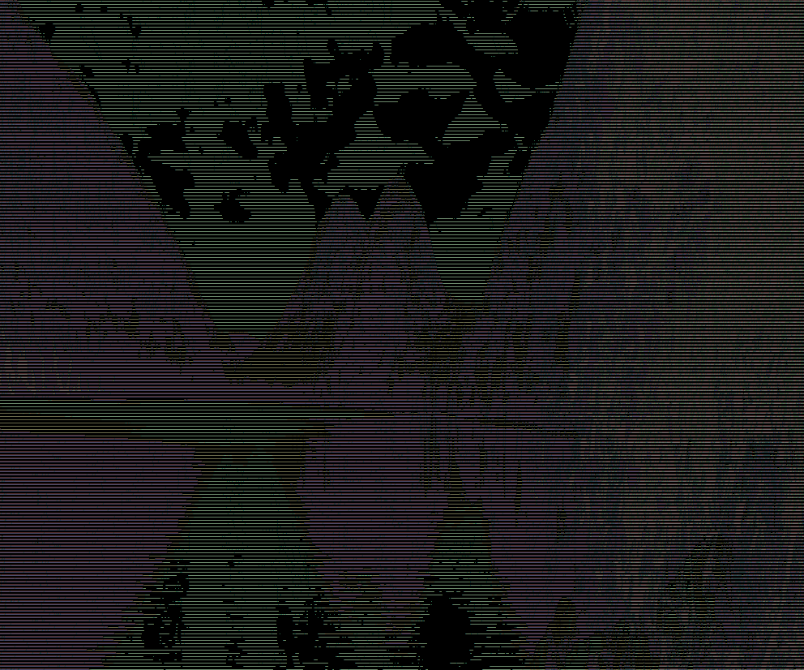
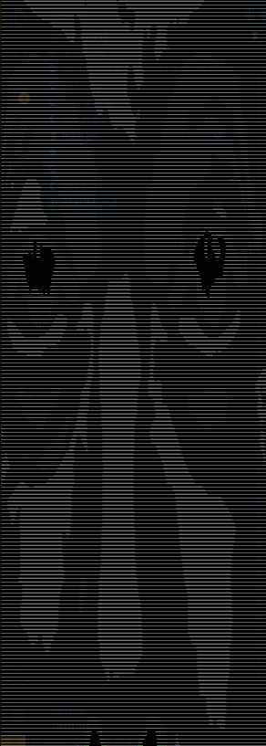
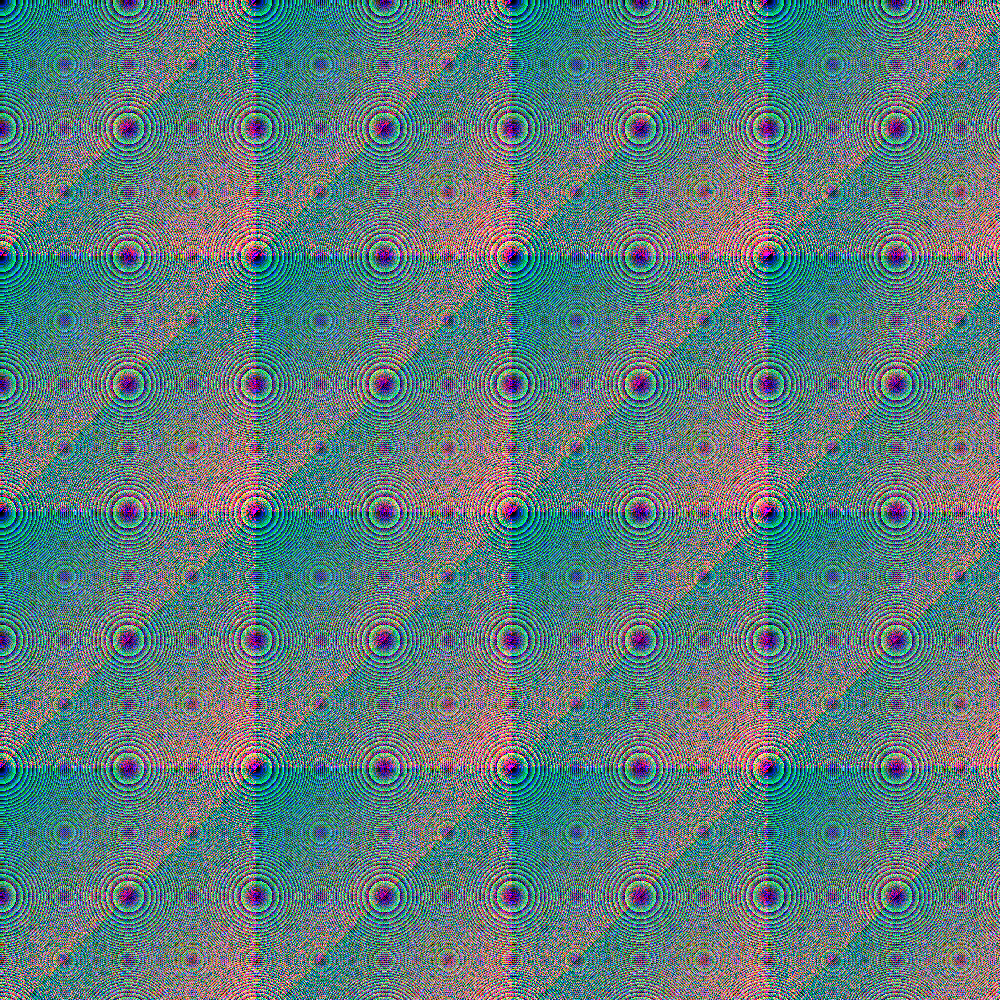
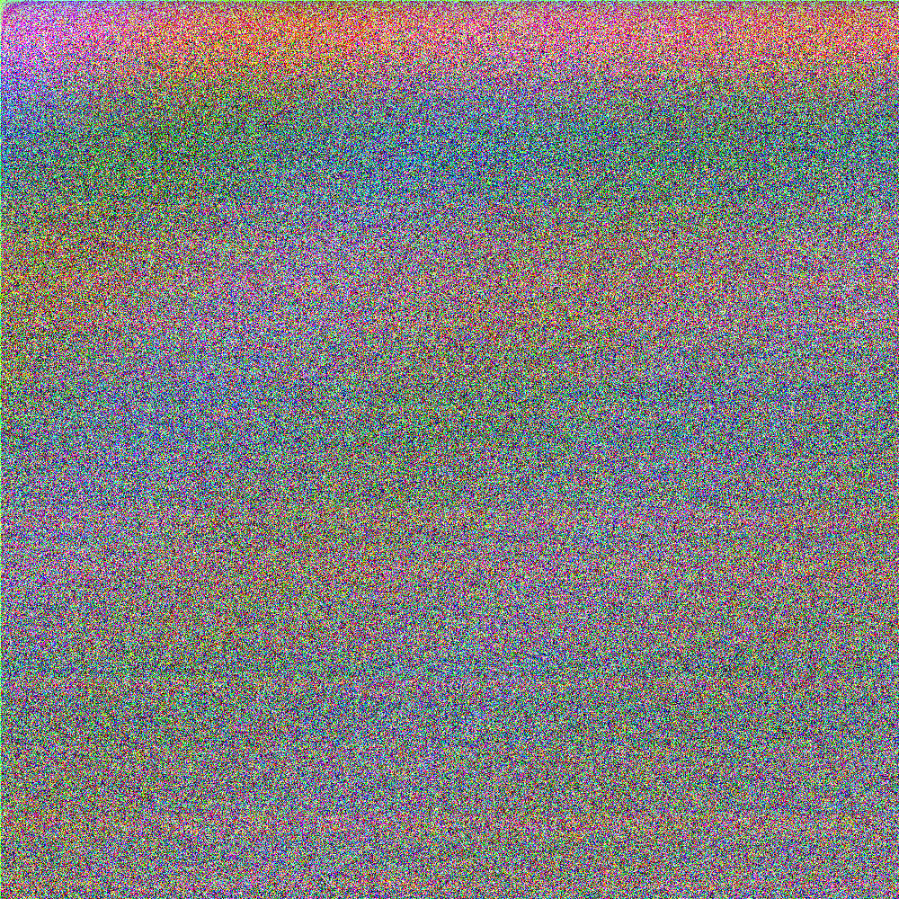
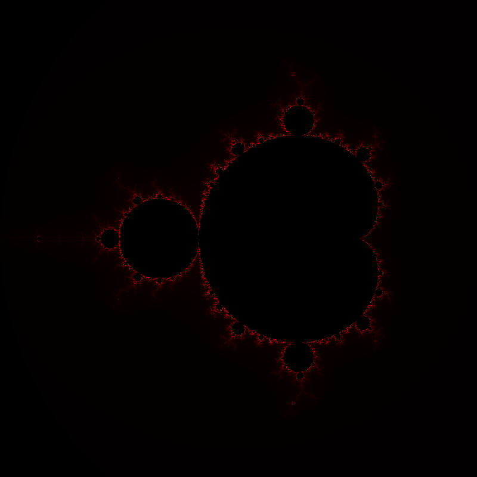
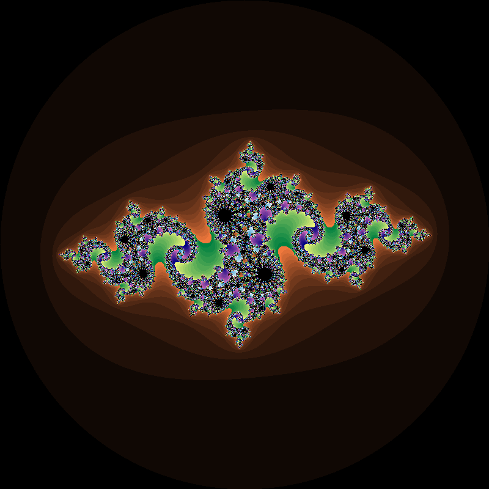
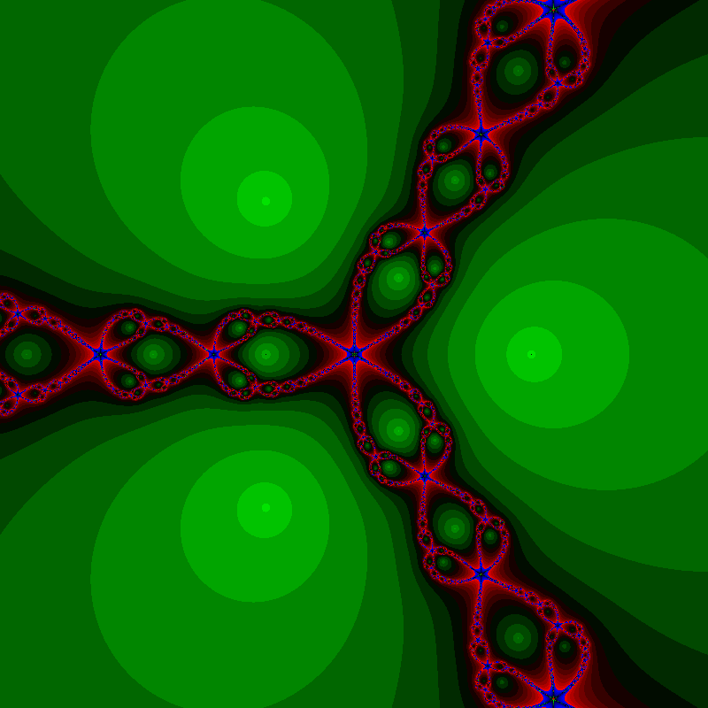
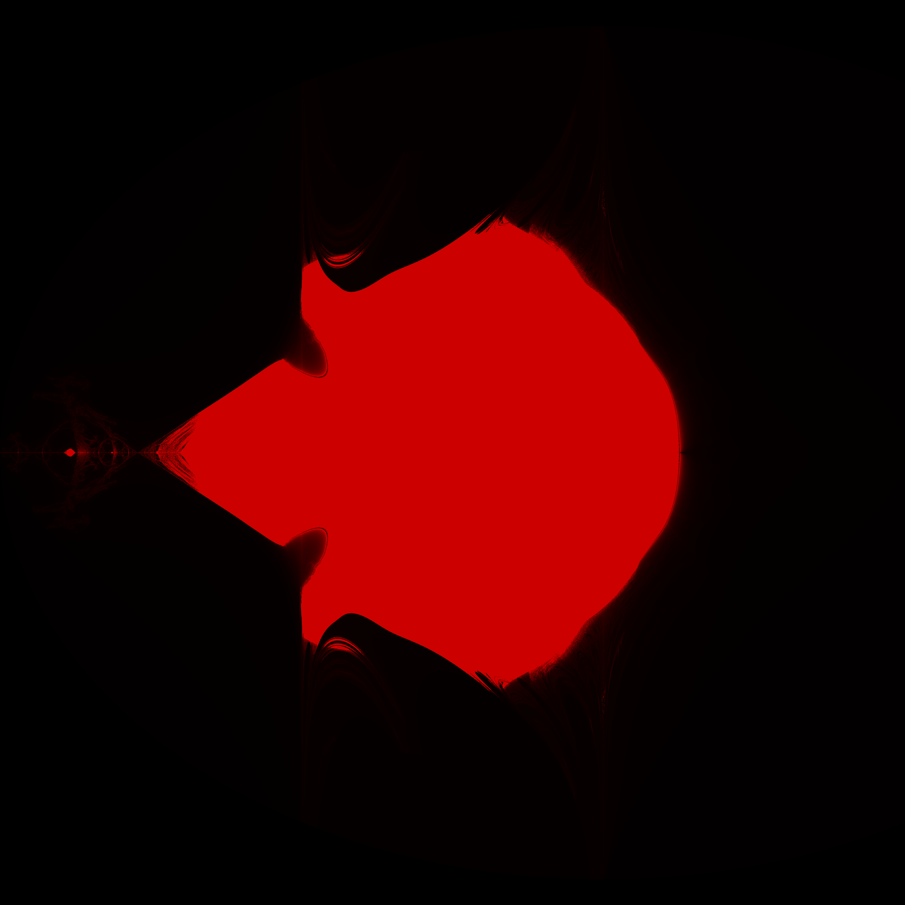

main.py -> Uisng pillow library to create FX using bit-wise logical operations after converting to grayscale.

png.c -> Partially following a tutorial from [Tsoading Daily on youtube](https://www.youtube.com/watch?v=M9ZwuIv3xz8) to learn how to read .png file signatures/bytes.

gpt_png.c -> Reading .png file bytes proceedurally; program written using ChatGPT's help.

[main.go]
may need ot zoom out a lot to see the full image generated. Will compartmentalize this feature as a separate function. Initially inspired by the tutorial [here.](https://golangdocs.com/golang-image-processing)

bg1i.png and cramer.png supplied as demo images; bg1i_terminal_06202023_440PMCST.png is the terminal output from processing bg1i.png

main.go cmdPrint() Example (6/20/2023 11:50PM CST):   
main.go Test 1 Input =   
main.go Test 1 Output =   
main.go Test 2 Input =   
main.go Test 2 Output =    
main.go trippyPng() Example (6/20/2023):   
   
main.go noisyPng() Example(6/20/2023):   
    

mb.go -> generates a .png of the [mandlebrot set](https://en.wikipedia.org/wiki/Mandelbrot_set) 
Example (6/21/2023):   
   
julia.go -> generates a .png of the [julia set](https://en.wikipedia.org/wiki/Julia_set) 
Example (6/21/2023):   
    
newton.go -> generates a .png of the [newton fractal](https://www.unf.edu/~ddreibel/teaching/newton/index.html)  
Example (6/21/2023):   
   
bs.go -> generates a .png of the [burning ship fractal](https://en.wikipedia.org/wiki/Burning_Ship_fractal). This one probably needs the most rendering to give an interesting picture.  
Example (6/21/2023):   
   
mandelbulb.go -> generates a .png of a [mandelbulb fractal](https://en.wikipedia.org/wiki/Mandelbulb)  
Example (8/27/2023):   
   
multibrot.go -> generates a .png of a [multibrot fractal](https://en.wikipedia.org/wiki/Multibrot_set) 
Example (8/27/2023):   
   
mandelbox.go -> generates a .png of a [mandelbox fractal](https://en.wikipedia.org/wiki/Mandelbox) 
Example (8/27/2023):   
TODO: doesn't generate at the moment
lyapunov.go -> generates a .png of a [lyapunov fractal](https://en.wikipedia.org/wiki/Lyapunov_fractal) 
Example (8/27/2023):   
TODO: doesn't generate at the moment
gosper.go -> generates a .png of a [gosper curve](https://en.wikipedia.org/wiki/Gosper_curve) 
Example (8/27/2023):   
   
tchebi.go -> generates a .png of [tchebichef fractal](https://arxiv.org/abs/2102.10640) 
TODO: tchebi.go not currently functioning; takes too long to finish execution (infinite loop perhaps? or i'm not patient enough?)