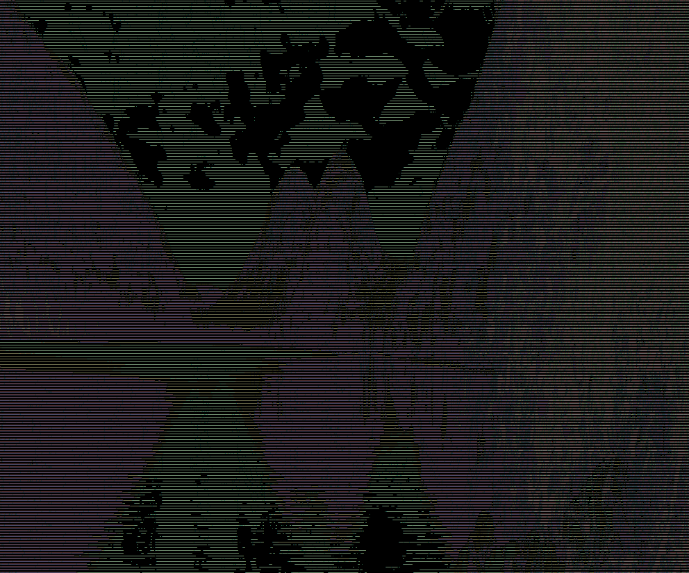

main.py -> Uisng pillow library to create FX using bit-wise logical operations after converting to grayscale.

png.c -> Partially following a tutorial from [Tsoading Daily on youtube](https://www.youtube.com/watch?v=M9ZwuIv3xz8) to learn how to read .png file signatures/bytes.

gpt_png.c -> Reading .png file bytes proceedurally; program written using ChatGPT's help.

main.go -> Reading .png files with golang's native libaries; so far just takes an image and converts it to ascii representation output to your terminal;
may need ot zoom out a lot to see the full image generated. Will compartmentalize this feature as a separate function. Initially inspired by the tutorial [here.](https://golangdocs.com/golang-image-processing)

bg1i.png and cramer.png supplied as demo images; bg1i_terminal_06202023_440PMCST.png is the terminal output from processing bg1i.png

Example (8:50PM CST)
Input = 

Output = 